# Soulie - sua companheira inteligente na SoulUp 🌱

A Soulie é um avatar gamificado e interativo criado para acompanhar os usuários da SoulUp, incentivar a continuidade das ações sustentáveis e tornar a jornada dentro da plataforma mais próxima, clara e recompensadora.

Este repositório contém a entrega de **Front-end Design Engineering da Sprint 03**, desenvolvida como uma **Single Page Application (SPA)** com React, Vite e TypeScript.

## 🔗 Links do projeto

- **Repositório no GitHub:** [github.com/EnzoNukui/soulie-sprint3](https://github.com/EnzoNukui/soulie-sprint3)
- **Aplicação publicada:** [soulie-sprint3.vercel.app](https://soulie-sprint3.vercel.app/)
- **Vídeo de apresentação:** [assistir no YouTube](https://youtu.be/nqB3IUTKXAY?si=EOsZCH2BwNNibNlt)


## 📌 Sobre o projeto

A **Soulie** é a solução desenvolvida para o Challenge 2026 em parceria com a **SoulUp**. A proposta busca reduzir a queda de retenção dos usuários por meio de uma experiência mais envolvente dentro da plataforma.

O avatar acompanha o progresso do usuário e reage com diferentes expressões e mensagens. A solução combina onboarding, missões personalizadas, progresso, recompensas e recorrência de uso para ajudar a transformar pequenas ações sustentáveis em hábitos duradouros.

Na Sprint 03, as páginas produzidas anteriormente foram migradas para uma aplicação moderna, componentizada e responsiva. A navegação ocorre sem recarregamento completo da página e os componentes compartilhados mantêm a identidade visual consistente em toda a experiência.

## ✨ Funcionalidades implementadas

- Navegação SPA entre Home, Sobre, Solução, Integrantes, FAQ e Contato.
- Rota dinâmica para o perfil individual de cada integrante por meio do RM.
- Cabeçalho fixo e menu responsivo para dispositivos móveis, tablets e desktops.
- Estados da Soulie controlados por rolagem e também selecionáveis por clique.
- Seções animadas de apresentação, progresso e funcionamento da solução.
- Formulário de contato tipado, com validações e mensagens de erro claras.
- Componentes reutilizáveis para botões, cards, conteúdo, menu, cabeçalho e rodapé.
- Página de erro para rotas inexistentes.
- Vídeo de animação da Soulie integrado à chamada final da Home.

## ✅ Requisitos da Sprint 03 atendidos

| Critério                  | Implementação no projeto                                                                                       |
| ------------------------- | -------------------------------------------------------------------------------------------------------------- |
| React + Vite + TypeScript | Aplicação criada com Vite, páginas convertidas em componentes React e código tipado com TypeScript.            |
| SPA com React Router      | Navegação configurada com `createBrowserRouter`, `RouterProvider` e `Outlet`.                                  |
| Rotas estáticas           | Rotas para Home, Sobre, Solução, Integrantes, FAQ e Contato.                                                   |
| Rota dinâmica             | Perfil individual disponível em `/integrantes/:rm`, usando o RM como parâmetro.                                |
| Componentização e props   | Componentes reutilizáveis como `Cabecalho`, `Menu`, `Rodape`, `Botao`, `Cards`, `Conteudo` e `CardIntegrante`. |
| Hooks do React            | Uso de `useState` e `useEffect` em diferentes páginas e componentes.                                           |
| Navegação e parâmetros    | Uso de `useNavigate` e `useParams` nos fluxos de navegação.                                                    |
| Tailwind CSS              | Interface estilizada com Tailwind e adaptada para mobile, tablet e desktop.                                    |
| React Hook Form           | Formulário de contato com `useForm`, tipagem, campos obrigatórios e mensagens de validação.                    |
| Git e GitHub              | Desenvolvimento versionado com branches e commits significativos por integrante.                               |

> Conforme a orientação da Sprint 03, o projeto não realiza consumo de API.

## 🛠️ Tecnologias utilizadas

- **React** - construção da interface e dos componentes.
- **Vite** - ambiente de desenvolvimento e build da aplicação.
- **TypeScript** - tipagem de componentes, propriedades, eventos e formulários.
- **Tailwind CSS** - estilização e responsividade da interface.
- **React Router DOM** - rotas estáticas, rota dinâmica e navegação SPA.
- **React Hook Form** - controle e validação do formulário de contato.
- **Lucide React** - ícones utilizados na interface.
- **Git e GitHub** - versionamento e colaboração da equipe.
- **Vercel** - publicação e acesso à versão atual do projeto.

## 📁 Estrutura de pastas

```text
soulie-sprint3/
├── my-app/
│   ├── public/
│   │   └── favicon/
│   ├── src/
│   │   ├── assets/
│   │   │   ├── avatar/
│   │   │   │   ├── expressoes/
│   │   │   │   ├── historia/
│   │   │   │   └── integrantes/
│   │   │   ├── integrantes/
│   │   │   └── produto/
│   │   ├── components/
│   │   │   ├── Botoes/
│   │   │   ├── Cabecalho/
│   │   │   ├── CardIntegrantes/
│   │   │   ├── Cards/
│   │   │   ├── Conteudo/
│   │   │   ├── Menu/
│   │   │   └── Rodape/
│   │   ├── routes/
│   │   │   ├── Contato/
│   │   │   ├── Error/
│   │   │   ├── Faq/
│   │   │   ├── Home/
│   │   │   ├── Integrantes/
│   │   │   ├── Sobre/
│   │   │   ├── Solucao/
│   │   │   └── Routes.tsx
│   │   ├── App.tsx
│   │   ├── globals.css
│   │   └── main.tsx
│   ├── index.html
│   ├── package.json
│   ├── tsconfig.json
│   └── vite.config.ts
└── README.md
```

## 🎭 Imagens e ícones do projeto

A Soulie possui diferentes expressões para comunicar o estado da jornada e tornar a interação mais humana.

| Expressão  | Imagem                                                                                                     | Aplicação                           |
| ---------- | ---------------------------------------------------------------------------------------------------------- | ----------------------------------- |
| Feliz      |            | Conclusão de missões.               |
| Radiante   |      | Marcos de progresso e recorrência.  |
| Sorridente |  | Evolução positiva na jornada.       |
| Bravo      |            | Interrupção de sequência ou alerta. |
| Triste     |          | Longos períodos de inatividade.     |
| Entediado  |    | Inatividade moderada.               |
| Tímido     |          | Onboarding e primeiras interações.  |
| Com dúvida |      | Ajuda e orientação ao usuário.      |
| Com pressa |  | Lembretes e urgência de missões.    |

O projeto também utiliza ilustrações da Soulie em diferentes poses, fotografias dos integrantes, imagens de apresentação da solução e uma animação em vídeo na Home.

## 📸 Páginas do site e evolução visual

### 🏠 Home

A página inicial apresenta a Soulie, os pilares da solução, a proposta de valor e chamadas para conhecer o projeto.

|                                               Antes                                                |                                            Depois                                             |
| :------------------------------------------------------------------------------------------------: | :-------------------------------------------------------------------------------------------: |
| 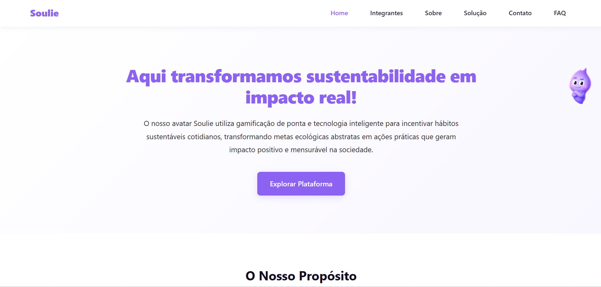 | 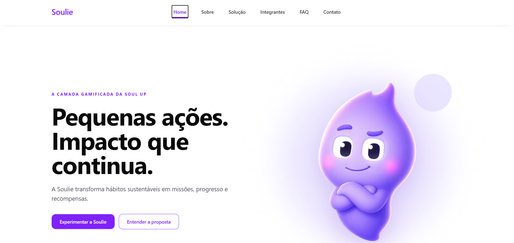 |

### 🛰️ Sobre

A página Sobre apresenta a origem da Soulie, suas expressões e a trajetória de acompanhamento do usuário.

|                                                    Antes                                                    |                                                 Depois                                                 |
| :---------------------------------------------------------------------------------------------------------: | :----------------------------------------------------------------------------------------------------: |
| 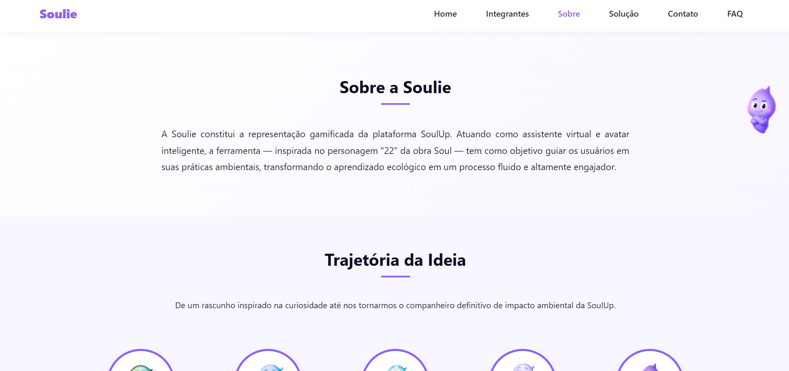 | 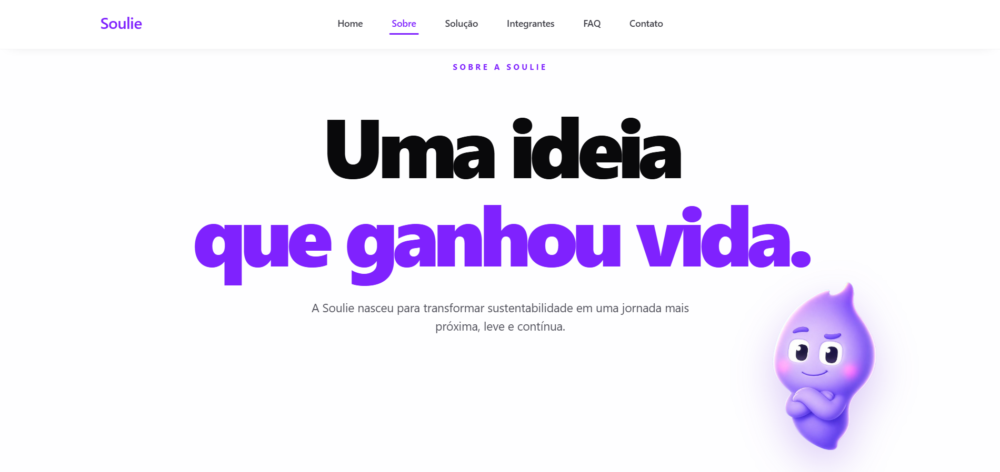 |

### ⚙️ Solução

A página Solução explica como missões, pontos, comunidades e recompensas transformam sustentabilidade em hábito.

|                                                      Antes                                                      |                                                   Depois                                                   |
| :-------------------------------------------------------------------------------------------------------------: | :--------------------------------------------------------------------------------------------------------: |
| 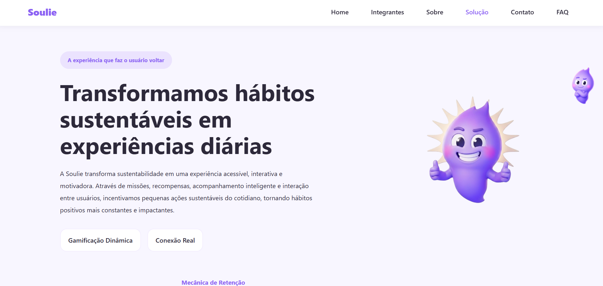 | 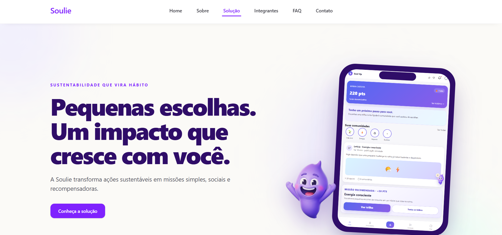 |

### 👥 Integrantes

A página Integrantes apresenta a equipe e permite acessar perfis individuais por uma rota dinâmica baseada no RM.

|                                                          Antes                                                          |                                                       Depois                                                       |
| :---------------------------------------------------------------------------------------------------------------------: | :----------------------------------------------------------------------------------------------------------------: |
| 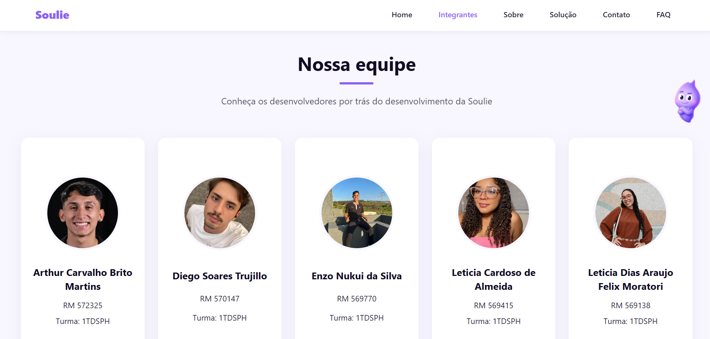 | 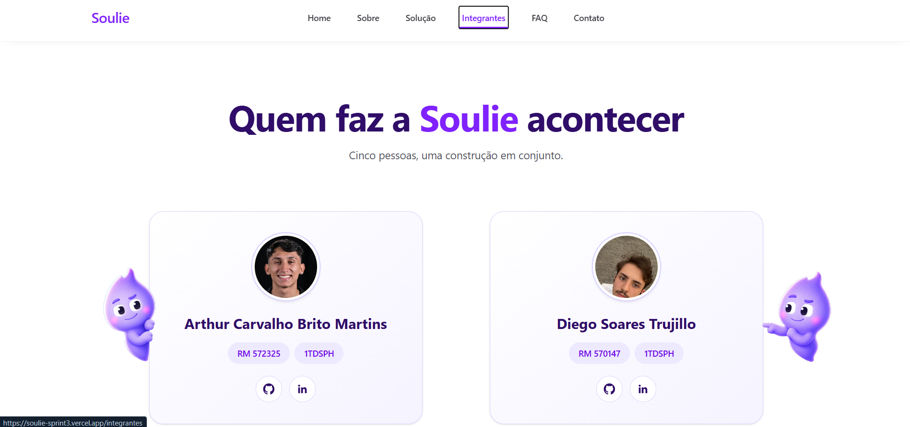 |

### ❓ FAQ

A página FAQ reúne as principais dúvidas sobre a Soulie em perguntas expansíveis.

|                                                  Antes                                                  |                                               Depois                                               |
| :-----------------------------------------------------------------------------------------------------: | :------------------------------------------------------------------------------------------------: |
| 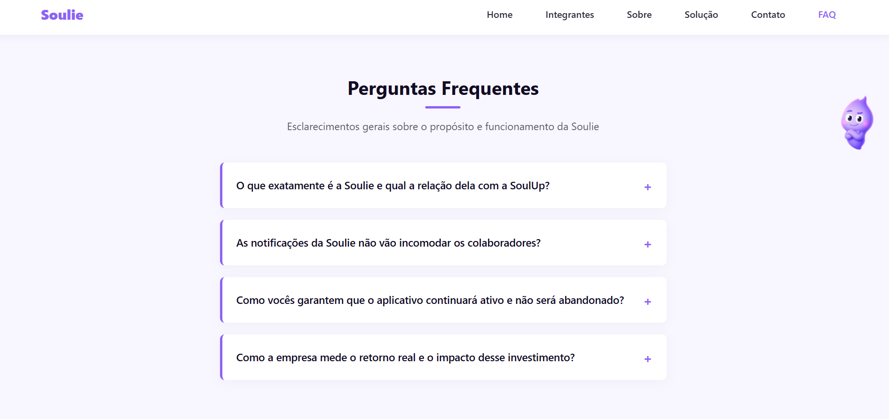 | 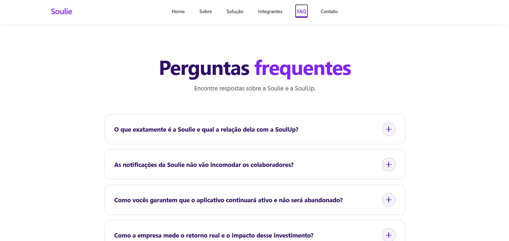 |

### ✉️ Contato

A página Contato disponibiliza um formulário validado para dúvidas, problemas técnicos, sugestões e feedbacks.

|                                                      Antes                                                      |                                                   Depois                                                   |
| :-------------------------------------------------------------------------------------------------------------: | :--------------------------------------------------------------------------------------------------------: |
| 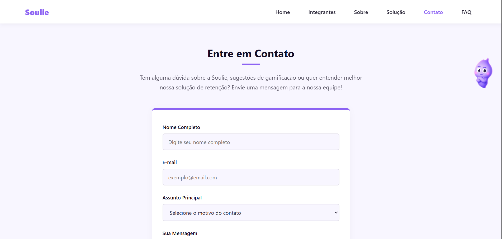 | 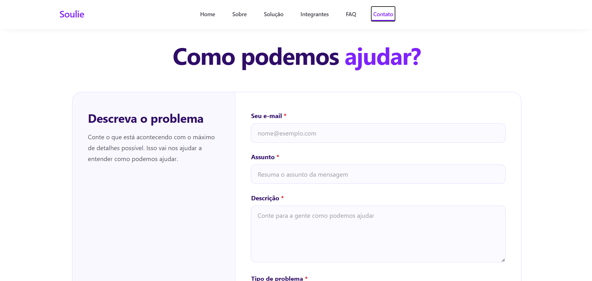 |

## 🎨 Organização visual e responsividade

A interface foi construída com componentes React reutilizáveis e classes utilitárias do Tailwind CSS, mantendo a identidade visual da Soulie consistente entre páginas, cards, botões, cabeçalho e rodapé.

O layout se adapta a celulares, tablets e computadores. Em telas menores, o conteúdo é reorganizado verticalmente e o menu passa a funcionar no formato responsivo; em larguras intermediárias e maiores, os espaçamentos, imagens e elementos de navegação são ajustados para preservar a legibilidade e evitar cortes ou sobreposições.

## 👥 Autores e créditos

<table>
  <thead>
    <tr>
      <th>Foto</th>
      <th>Integrante</th>
      <th>RM</th>
      <th>Turma</th>
      <th>LinkedIn</th>
      <th>GitHub</th>
    </tr>
  </thead>
  <tbody>
    <tr>
      <td></td>
      <td>Arthur Carvalho Brito Martins</td>
      <td>RM 572325</td>
      <td>1TDSPH</td>
      <td><a href="https://www.linkedin.com/in/arthur-martinss/">LinkedIn</a></td>
      <td><a href="https://github.com/arthurmartinss">GitHub</a></td>
    </tr>
    <tr>
      <td>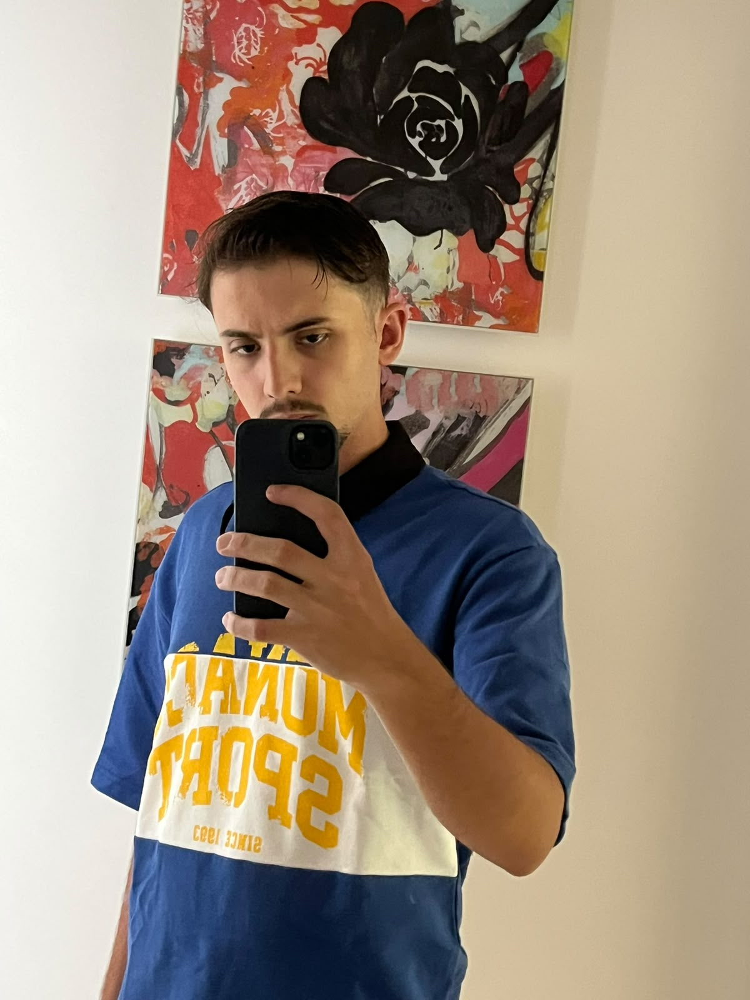</td>
      <td>Diego Soares Trujillo</td>
      <td>RM 570147</td>
      <td>1TDSPH</td>
      <td><a href="https://www.linkedin.com/in/diego-trujillo-3441b9380/">LinkedIn</a></td>
      <td><a href="https://github.com/diegotrujillo011">GitHub</a></td>
    </tr>
    <tr>
      <td>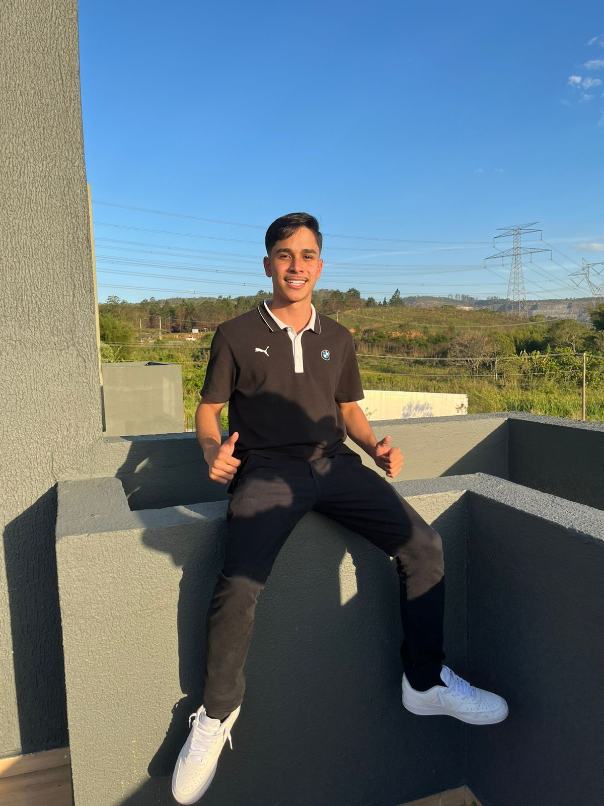</td>
      <td>Enzo Nukui da Silva</td>
      <td>RM 569770</td>
      <td>1TDSPH</td>
      <td><a href="https://www.linkedin.com/in/enzo-nukui/">LinkedIn</a></td>
      <td><a href="https://github.com/EnzoNukui">GitHub</a></td>
    </tr>
    <tr>
      <td></td>
      <td>Leticia Cardoso de Almeida</td>
      <td>RM 569415</td>
      <td>1TDSPH</td>
      <td><a href="https://www.linkedin.com/in/let%C3%ADcia-almeida-70b851294/">LinkedIn</a></td>
      <td><a href="https://github.com/lehalmeidafc0">GitHub</a></td>
    </tr>
    <tr>
      <td></td>
      <td>Leticia Dias Araujo Felix Moratori</td>
      <td>RM 569138</td>
      <td>1TDSPH</td>
      <td><a href="https://www.linkedin.com/in/leticia-felix-660253286">LinkedIn</a></td>
      <td><a href="https://github.com/LeticiaFelix18">GitHub</a></td>
    </tr>
  </tbody>
</table>

## 🚀 Como executar localmente

### Pré-requisitos

- Node.js instalado.
- npm instalado.
- Git instalado para clonar o repositório.

### Instalação e execução

1. Clone o repositório:

```bash
git clone https://github.com/EnzoNukui/soulie-sprint3.git
```

2. Acesse a pasta da aplicação:

```bash
cd soulie-sprint3/my-app
```

3. Instale as dependências:

```bash
npm install
```

4. Inicie o ambiente de desenvolvimento:

```bash
npm run dev
```

5. Abra no navegador o endereço exibido pelo Vite no terminal.

### Verificações disponíveis

```bash
npm run lint
npm run build
npm run preview
```

- `npm run lint` verifica a qualidade do código.
- `npm run build` valida o TypeScript e gera a versão de produção.
- `npm run preview` permite visualizar localmente a versão gerada.

## 📬 Contato

- Envie dúvidas, sugestões ou feedbacks pelo [formulário de contato da Soulie](https://soulie-sprint3.vercel.app/contato).
- Para assuntos relacionados ao código, utilize as [Issues do repositório](https://github.com/EnzoNukui/soulie-sprint3/issues).
- Os perfis profissionais de todos os integrantes estão disponíveis na seção **Autores e créditos**.

## 📌 Status do projeto

O front-end da **Sprint 03** está funcional e disponível na Vercel. A versão atual reúne as páginas obrigatórias, navegação SPA, rota dinâmica de integrantes, interações com estado, responsividade e formulário validado.

Este é um projeto acadêmico em evolução. Nesta sprint não há consumo de API, conforme a orientação da atividade; integrações externas poderão ser desenvolvidas em etapas futuras.

## 💜 Agradecimentos

Agradecemos à **FIAP**, aos professores responsáveis pela orientação técnica e à **SoulUp** pela oportunidade de desenvolver uma solução voltada à sustentabilidade e ao engajamento. Também agradecemos a todas as pessoas que contribuíram com ideias, testes e feedbacks durante a evolução da Soulie.

## 📄 Licença

Este projeto foi desenvolvido exclusivamente para fins acadêmicos no **Challenge FIAP 2026**, em parceria com a **SoulUp**. O uso, a reprodução ou a adaptação do conteúdo deve preservar os créditos dos autores e respeitar as marcas e os materiais de seus respectivos titulares.
